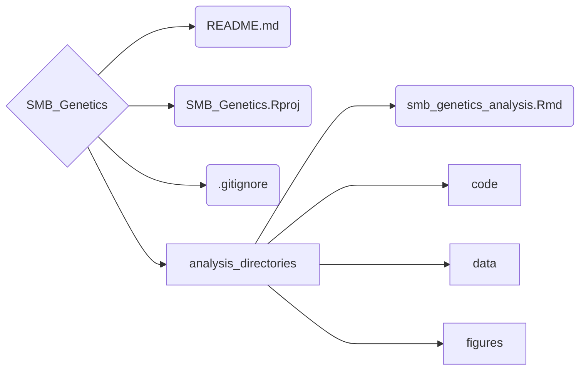
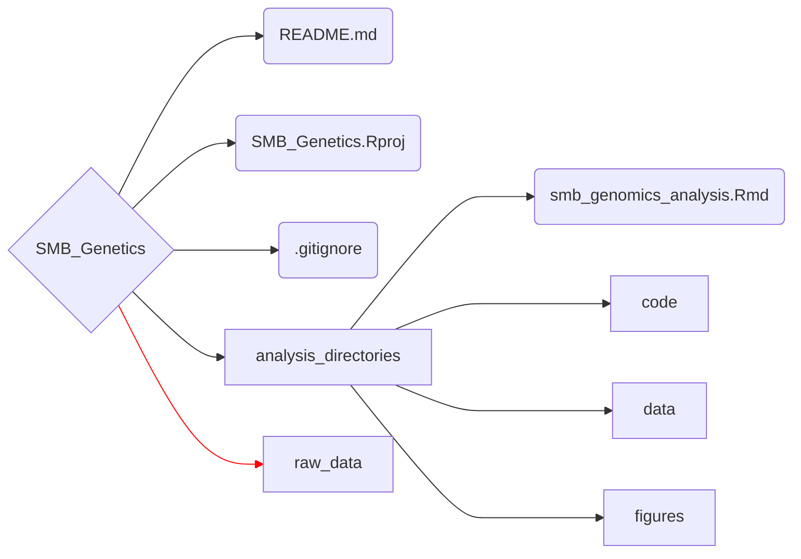

# Reproduce analyses for Gunn et al. 2020
Follow the steps listed below in the <b><i>Analyses</i></b> section to reproduce analyses for Gunn et al. (2020). Each step below gives a summary of the analysis and directs you to a general code file which then works through the analysis step-by-step. This general file will usually point you to other Rmd code, bash shell scripts, or python scripts. Each analysis is contained within sub-directories of the same name in the main R project directory.

<b>Find the article here</b>: <a href="url">https://link.springer.com/article/10.1007/s10592-020-01295-1</a> 

<b>Citation here</b>: Gunn, J. C., Berkman, L. K.,Koppelman, J., Taylor, A. T., Brewer, S. K., Long, J. M., & Eggert, L. S. (2020). Complex patterns of genetic and morphological differentiation in the Smallmouth Bass subspecies (<i>Micropterus dolomieu dolomieu</i> and <i>M. d. velox</i>) of the Central Interior Highlands. <i>Conservation Genetics</i>, 21, 891-904.

# Project: Population genetic structure and morphological differentiation between Northern Smallmouth Bass (<i>Micropterus dolomieu dolomieu</i>) and Neosho Smallmouth Bass (<i>M. d. velox</i>)
We investigated patterns of genetic (via microsatellites) and morphological diversity, differentiation, and structure across Smallmouth Bass populations (<i>Micropterus dolomieu</i>) in the Central Interior Highlands (CIH) of North America, including the two recognized subspecies: Northern Smallmouth Bass (<i>M. d. dolomieu</i>), which is native to the lower Ozark Highlands, and Neosho Smallmouth Bass (<i>M. d. velox</i>), which is endemic to tributaries of the Arkansas River Basin. We compared three independent combinations of starting parameters in the Bayesian clustering software program STRUCTURE to ascertain a robust picture of hierarchical genetic structure in the CIH. We paired these data with genetic diversity metrics (e.g., observed and expected heterozygosity and allelic richness) to determine relative amounts of variation across geographically separated populations. We then assessed differentiation in five morphometric and meristic traits. We ultimately aimed to validate or amend the taxonomic status of the Smallmouth Bass subspecies by revealing potential ecological and evolutionary divergence between them, with the hope that increased taxonomic resolution would provide insight into the presence and distribution of evolutionary significant and management units for a popular sportfish.

## General information on repository structure
This is a publicly visible GitHub repository storing code (and a small amount of data, although we have done our best to avoid uploading large amounts of data due to the limited storage in GitHub) for Gunn et al. (2020). In the home directory of the repository (SMB_Genetics), you will find a README.md file (the source script for this information), the R Project file (SMB_Genomics.Rproj), a .gitignore file, and [NUMBER] different "analysis" directories, each of which corresponds with a specific analysis conducted in our study:

1) 01_map_analysis
2) 02_data_summary_analysis
3) 03_structure_analysis
4) 04_genetic_diversity_analysis
5) 05_morphological_analysis

Within each analysis directory, you will find an R markdown script (.Rmd) with the name of the analysis, which contains all of the code needed to run the full analysis. Additionally, you will find:

1) code

The code directory will store all source code, shell scripts, lists of bash commands, and software packages needed for analysis. 

Once you have downloaded the repository and located the code directory, you should create two additional sub-directories within each analysis (on the same level as the code directory):

2) data
3) figures

The data directory will store all raw data, processed data, and metadata needed for analysis. The figures folder will contain any raw figures generated in ggplot for each analysis. Ideally, the Rmd script should have paths set up so that the code reads all data and scripts and generates figures seamlessly.

Figure 1. Graphical map of project directory structure

## Using the code
To reproduce all analyses in Gunn et al. (2020), download this repository and place in a desired home directory. This may be done on your local machine, but we recommend downloading to a high-performance computing cluster so that all code will run seamlessly in one environment, as long as Rstudio is installed and the GUI can be called on the cluster.

Once all directories are downloaded, create a new sub-directory within the home directory (same level as the seven analysis directories, .Rproj, README.md, etc.) called "raw_data". This is where you will store the raw genomic data and associated sample metadata (see <i><b>Data</i></b> section below).

Figure 2. Include a `raw_data` directory in the project home directory

## Data
Raw microsatellite genotype calls (.xlsx), morphological data (.xlsx), and accompanying metadata (.xlsx) are available at Zenodo.org: <a href="url">https://doi.org/10.5281/zenodo.3937432.</a>

Download these data to your working directory and place in the /raw_data directory. You are good to start analyzing.

If you have any questions or issues with data and/or code, please don't hesitate to contact me: jcgunn@uvm.edu

## Analyses

### Analysis 1: Generating species native range maps
In this analysis, we generated easily readable maps displaying the native distributions of the two subspecies of interest, Northern Smallmouth Bass and Neosho Smallmouth Bass. We generated two types of maps: 1) a full range map, in which the full native range of each species is displayed, and 2) a close-up map of the Central Interior Highlands (CIH), where the paraptry of the species' ranges is shown in detail. In R, we generated only geo-referenced outlines of these maps. Shapes representing stream sites and/or populations were superimposed <i>a posteriori</i> on the maps in PowerPoint.

#### Run the code: `01_map_analysis/smb_genetics_map_analysis.Rmd`

### Analysis 2: Data enumeration, filtering and metadata summary analysis
In this analysis, we read in, clean, and enumerate the raw microsatellite genotype data, morphological trait data, and associated sample metadata (i.e., information about subspecies, collection location, and geographic region) for our Northern and Neosho Smallmouth Bass samples. After we prepare data, we summarize sample sizes within and across important groups.

#### Run the code: `02_data_summary_analysis/smb_genetics_data_summary_analysis.Rmd`

### Analysis 3: Hierarchical population structure analysis
In this analysis, we use Bayesian clustering analysis and genotypes from 14 microsatellite loci with STRUCTURE to assess patterns hierarchical genetic structure among and within black bass species (i.e., Spotted Bass and Smallmouth Bass) and subspecies (i.e., Northern Smallmouth Bass and Neosho Smallmouth Bass) in the CIH. To maximize our ability to ascertain potentially complex or cryptic levels of genetic diversity, we employ and integrate three independent "methods" within STRUCTURE, which each use either different starting parameters for identifying genetic clusters or different inference techniques for determining the optimal number of clusters: 1) <i>default parameters</i> (default parameters in STRUCUTRE); 2) <i>Wang parameters</i> (parameters recommended by Wang (2017); and 3) <i>Puechmaille metrics</i> (optimal cluster inference method recommended by Puechmaille 2016).

#### Run the code: `03_structure_analysis/smb_genetics_structure_analysis.Rmd`

### Analysis 4: Genetic diversity and differentiation analysis
In this analysis, we use genotypes from 14 microsatellite loci to compare genetic diversity metrics within and among populations of Neosho Smallmouth Bass and Northern Smallmouth Bass in the CIH. We first calculate pairwise Fst to assess genetic differentiation between each pair of populations and between subspecies. We then calculate rarefied allelic richness, allelic richness of common alleles, expected and observed heterozygosity, and private allelic richness, and we calcualte average differences in each metric across sampling sites and subspecies.

#### Run the code: `04_diversity_analysis/smb_genetics_diversity_analysis.Rmd`

### Analysis 5: Morphological differentiation analysis
In this analysis, we assess morphological differentiation between Neosho Smallmouth Bass and Northern Smallmouth Bass in the CIH using five morphometrics (traits with continuous distributions; total length, standard length, body depth, head length, and orbital length) and one meristic (discrete count trait; soft dorsal fin rays) and three independently analysis frameworks: 1) individual analyses of covariance (ANCOVAs) on morphometric traits; 2) multiviariate discriminant function analysis (DFA) on morphometric traits; and 3) logistic regression on soft dorsal fin rays. With ANCOVA, we assess differentiation between subsepecies at each trait individually. With DFA, we assess the accuracy with which an individual can be assigned to either subspecies based on composite trait values. With logistic regression, we assess the probability with which a Neosho Smallmouth Bass and Northern Smallmouth Bass possess a specific number of soft dorsal rays.

#### Run the code: `05_morphology_analysis/smb_genetics_morphology_analysis.Rmd`

